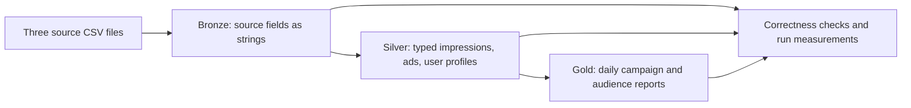

# Baseline contract

The only implementation in scope is a local, full-rebuild batch pipeline. Input is
the complete Taobao `raw_sample.csv`, `ad_feature.csv`, and `user_profile.csv`.
The shopping behavior log is outside this baseline.

All three layers are local Delta Lake tables. Delta stores data in Parquet plus
a transaction log. This is our starting storage format, already with built-in
compression and statistics; it is not a CSV-versus-Parquet optimization experiment.

## Boundaries

- Four local Spark worker threads, 2 GiB driver heap, Python 3.11, PySpark 4.0.1,
  Delta Lake 4.0.0, Java 17 or 21. Record the actual runtime versions for every run.
- Keep SQL defaults, including adaptive execution and automatic broadcast joins.
  Do not disable Spark's optimizer to manufacture a slow starting point.
- No manual broadcast hints, caching, repartition/coalesce, partitioned table
  layouts, clustering, bucketing, salting, compaction, incremental loads, or tuning.
- No cloud deployment, streaming, Databricks implementation, or behavior-log work.
- Start every run in a new directory. Never append to the previous result or
  overwrite the source. A failed run remains inspectable and is not a valid baseline.
- Gold aggregates are the required reporting products; additional acceleration
  tables or optimization experiments are outside this version.

## Model and correctness

- Bronze keeps source field names and string values, with source-file provenance.
  CSV empty fields become null. Literal `NULL` remains text until Silver. Trim
  whitespace around header names (the supplied profile header has a trailing space).
- Silver impressions: one supplied impression row; retain the original user/ad
  identifiers, timestamp seconds, placement, click and non-click indicators. Add an
  event timestamp and reporting date. Do not deduplicate or invent an event ID.
- Silver ads: one row per `adgroup_id`; `customer` becomes `advertiser_id`.
  `price` becomes `product_price`, never advertising spend or conversion revenue.
  Preserve price outliers; missing brand becomes null.
- Silver user profiles: one row per `userid`, renamed `user_id`. These are supplied
  profile snapshots, not historical versions. Missing attributes remain null.
- Reporting dates use **Asia/Shanghai**, an explicit project assumption.
- Dimension keys must be unique. All impressions must match an ad. Missing user
  profiles are allowed and reported; left joins preserve these impressions.
- Gold campaign daily grain: reporting date, campaign ID, advertiser ID.
- Gold audience daily grain: reporting date, advertiser ID, age level. Null age
  remains an unknown group, including missing profiles. Both tables expose
  impressions, clicks, and CTR (`clicks / impressions`), plus missing-profile counts.
- Assert valid binary click flags, `clk + nonclk = 1`, valid required keys/times,
  no cast failures, row preservation, and matching impression/click totals in Gold.
  Unsupported demographic codes are preserved, not given invented labels.

## Measurement

Record stage wall times, validation time separately, total elapsed time, source
checksums/bytes, table rows/files/bytes, effective Spark settings, and Spark event
logs. Summarize task input, shuffle, spill, and executor time from event logs.
Task byte counters describe Spark task activity (including checks/retries), not
unique physical disk reads. Storage reports describe this run, not the whole disk.
Local runtime and bytes are the cost proxies; do not invent a cloud dollar cost.
One measured run is a reference observation, not a statistically stable benchmark.

## References

- [Dataset](https://tianchi.aliyun.com/dataset/56)
- [Alibaba's table descriptions](https://www.alibabacloud.com/help/en/maxcompute/user-guide/overview-of-public-datasets#digital-commerce-dataset)
- [Download mirror](https://huggingface.co/datasets/Angrybird12/ad-display_click-data_taobao.com/tree/main)
- [Spark/Delta compatibility](https://docs.delta.io/releases/)

The model is grounded in the inspected Taobao fields. The Databricks industry
model repository is a conceptual reference; this baseline does not import or run
its models, tooling, or Databricks-specific metric views.
